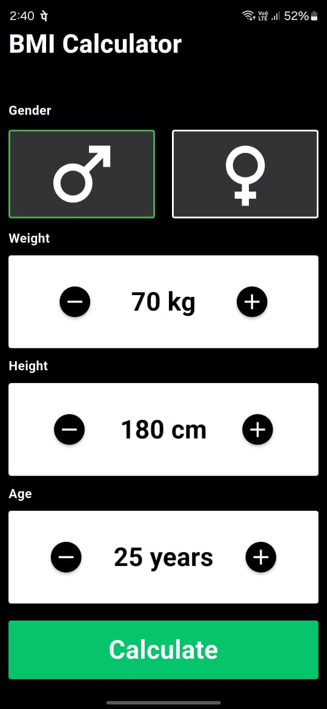
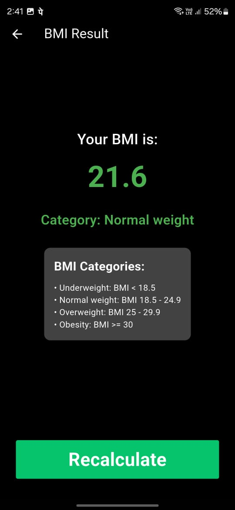

# bmi_2

My First Flutter project.  
- As the app name suggests it calculates your BMI  

## Screenshots

    
    

 
 

[Click Here To Download](https://github.com/rohithvishaal/bmi_2/releases/download/production/BMI.apk)

